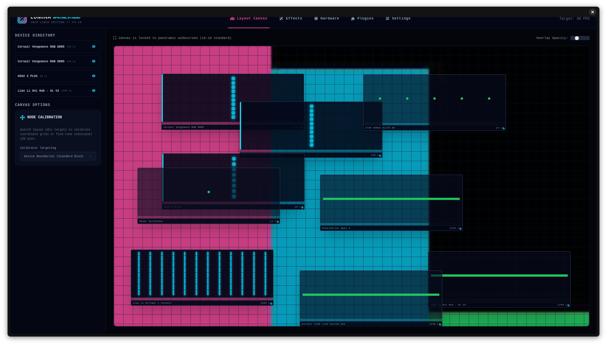
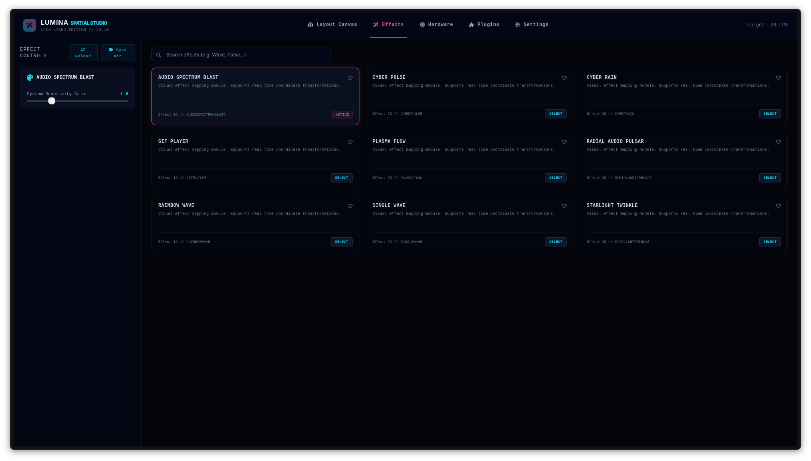
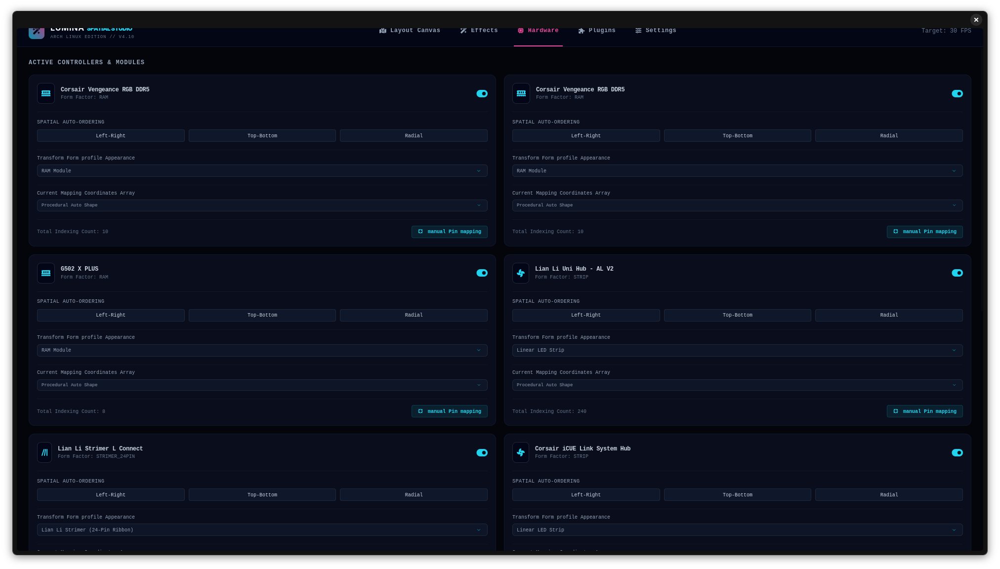
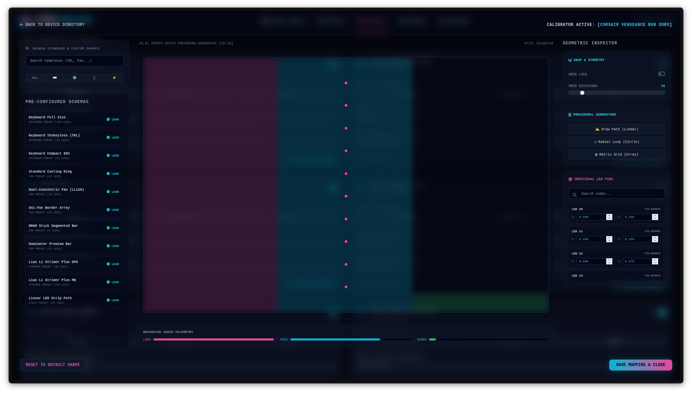
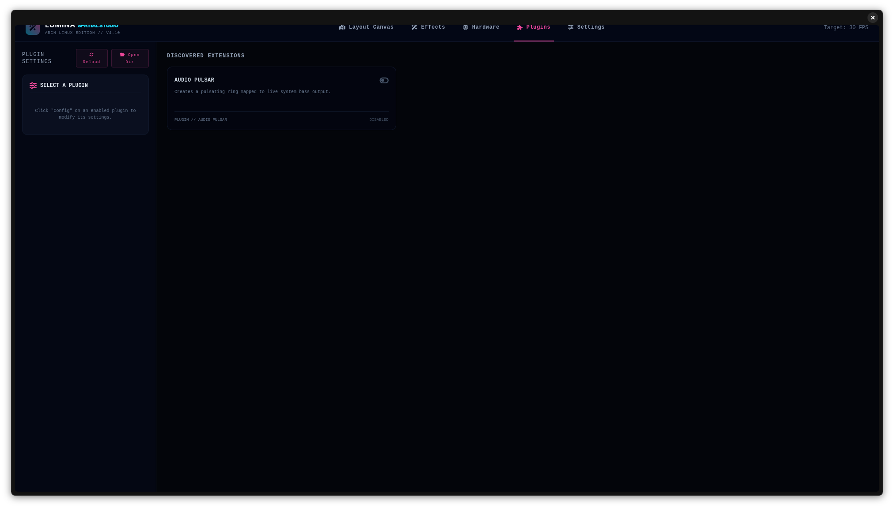
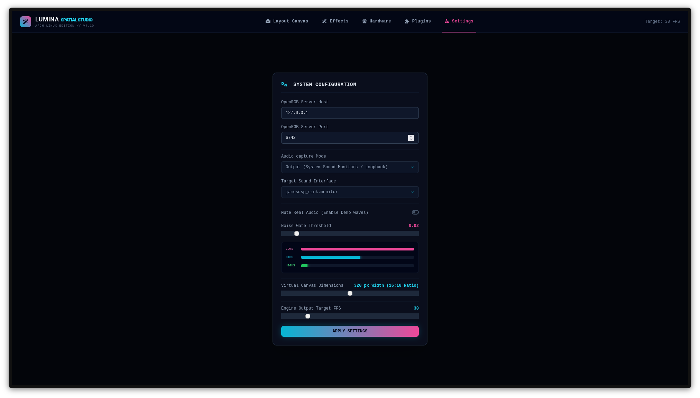

keywords: 2D spatial RGB lighting controller, Linux, Arch Linux, OpenRGB, virtual canvas.

Lumina Spatial Studio

Lumina Spatial Studio is an open-source, highly customizable 2D spatial RGB
lighting controller and calibration suite built for Linux (optimized for Arch
Linux).

The application is engineered in collaboration with Gemini (Google AI Studio).
It merges a clean FastAPI/Uvicorn backend service with a highly responsive,
modern glassmorphic web portal UI, enabling low-latency, aspect-locked lighting
effects mapped directly across your physical desktop setup.

Instead of managing isolated LED zones, Lumina renders visual effects onto a
widescreen 16:10 virtual canvas. It samples color coordinates beneath draggable,
resizable, and rotatable hardware blocks, sending real-time color packets
directly to physical devices via an OpenRGB SDK server connection.

🚀 Key Features

1. 2D Panoramic Virtual Canvas Workspace

  - Aspect-Locked Workspace: Projects 2D lighting patterns onto a widescreen
    virtual canvas (defaulting to 320x200 resolution) for accurate visual
    continuity.
  - Draggable & Resizable Bounds: Drag, scale, and adjust physical hardware
    representations (keyboards, RAM modules, cooling fan rings, and ribbon
    cables) directly over the canvas coordinates.
  - Rotatable Bounds Mapping: Rotate hardware blocks from 0^{\circ} to
    360^{\circ}. Lumina's translation engine automatically updates sampling
    coordinates on the fly using 2D rotational trigonometry.
  - Layout Directory & Visibility Toggles: Hide individual device layouts in the
    workspace to declutter your screen while keeping them active.

2. Manual Pin Mapping Studio

  - Three-Column Dedicated Overlay: Click "manual Pin mapping" on any device
    card to launch a fully-featured calibration workspace.
  - Searchable Shape Library & Presets: Instantly load pre-configured geometric
    schemas (Full-size keyboards, TKLs, LL120 cooling rings, RAM bars, or GPU
    Strimer cables).
  - Grid-Lock & Snapping: Snap individual LED coordinate pins to custom
    sub-divisions (4 \times 4 to 100 \times 100) for clean geometrical
    alignment.
  - Named Profiles Database: Calibrate relative curves, curves, or customized
    alignments and save them as named profiles directly in your database.

3. Decoupled Real-Time Audio Capture

  - Zero-Dependency Capture: Spawns an isolated, native operating system process
    (pw-record for PipeWire or parecord for PulseAudio) to stream 16-bit binary
    PCM data directly into Python's stdout. This prevents the rendering loop
    from blocking and avoids main-thread lag.
  - FFT & Noise Gate Analysis: Processes Fast Fourier Transforms (FFT) with an
    adjustable RMS-level Noise Gate threshold to filter out ambient room noise.
  - Real-time Telemetry: View reactive low, mid, and high frequency audio
    visualizer bars on both the main dashboard and inside the Calibration
    Studio.

4. Writable Home Directory Redirection (~/.config/lumina/)

  - Bypasses Read-Only Constraints: On launch, the backend automatically creates
    a writable home directory structure at /home/YOUR_USER/.config/lumina/ and
    copies all default assets there.
  - Direct Folder Openers: Click Open Dir inside the Effects or Plugins tab
    sidebars to instantly launch your default system file manager (e.g.,
    Nautilus) pointing to those folders on your hard drive.
  - Instant Hot-Reloading: Drop new custom effect or plugin .py scripts into
    ~/.config/lumina/effects/ or ~/.config/lumina/plugins/, and click Reload in
    the UI. The engine will cleanly restart and load your new scripts without
    requiring a terminal reboot.

  

  

  

  

  

  

🛠️ Installation & Setup

Prerequisites

Ensure you have your Linux audio server and OpenRGB server installed and active:

# 1. Install OpenRGB and GStreamer dependencies (Arch Linux)
sudo pacman -S openrgb pipewire-audio base-devel

# 2. Start your OpenRGB Server in the background (Default port: 6742)
openrgb --server

Installation

1.  Clone the repository:

    git clone https://github.com/profxsx/Lumina-Spatial-RGB.git
    cd Lumina-Spatial-RGB

2.  Install Python dependencies: (It is recommended to run this inside a virtual
    environment)

    pip install -r requirements.txt

3.  Start Lumina Spatial Studio:

    python main.py

On launch, the FastAPI backend will start up on http://127.0.0.1:8000 and
automatically trigger your default web browser (Firefox, Chrome, Brave, etc.) to
open your Lumina Control Panel.

✍️ How to Add Custom Effects & Plugins

Because of Lumina's standard directory redirection, adding custom effects is
straightforward:

1.  Go to the Effects (Tab 2) or Plugins (Tab 3) in your browser.
2.  Click the Open Dir button in the top-right of the sidebar. Nautilus will
    open directly inside your configuration folder (e.g.,
    ~/.config/lumina/effects/).
3.  Drop your custom .py effect file into that folder.
4.  Click the Reload button in your browser sidebar. The backend will re-scan
    the folder and list your new custom effect instantly.
    
ToDo list

Govee plugin

Better UI

Make it open as app with the ability to open it through web ui in the settings

More effects

  👥 Contributors

  - @profxsx (profxsx) — Lead Developer & Architect
  - Google AI Studio (Gemini) — AI Co-Engineer & Assistant Architect
